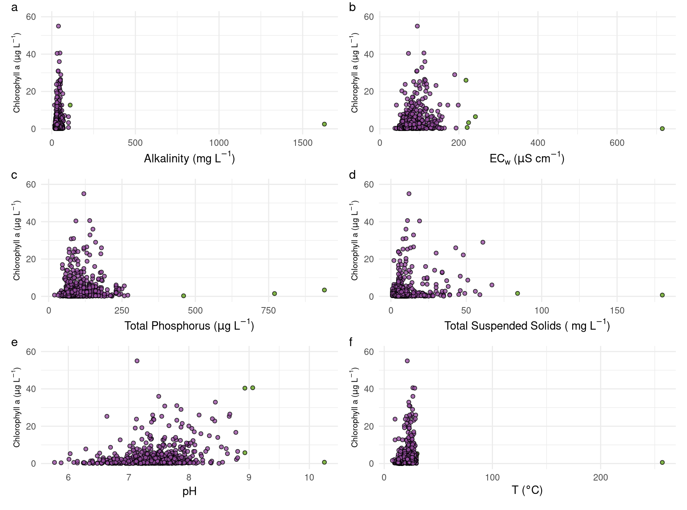
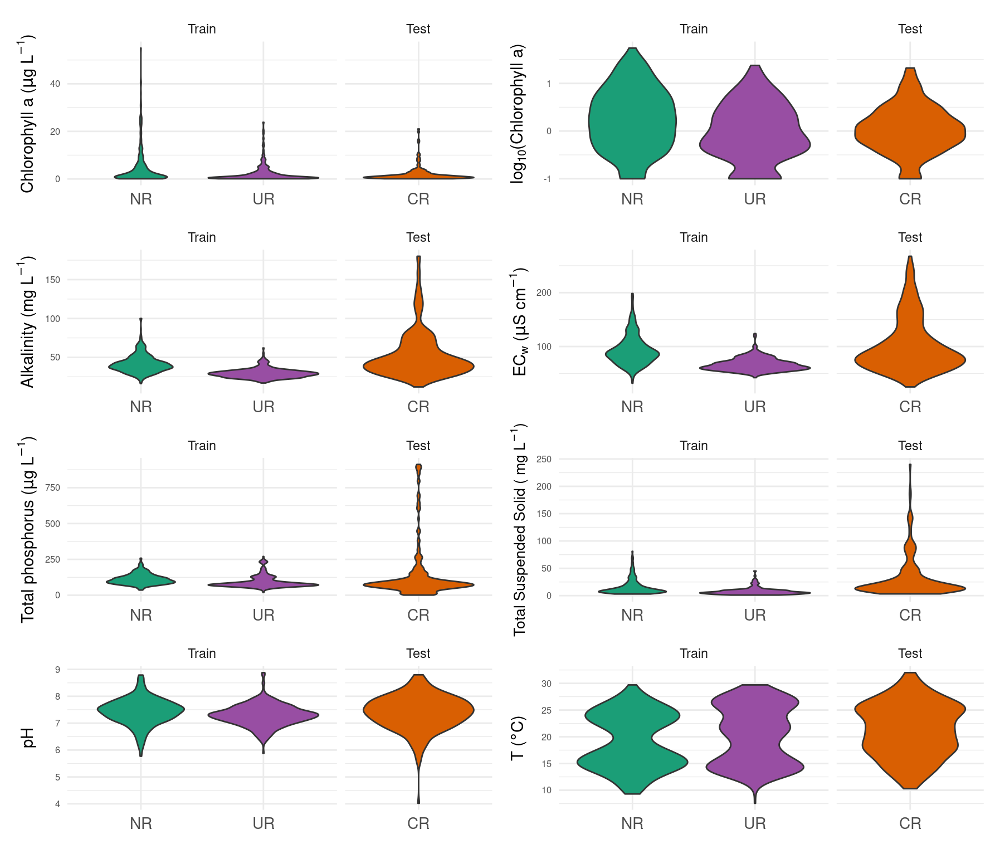

Data Analysis and Figures
================

This script include all analysis of the paper: “A reply to” Relevant
factors in the eutrophication of the Uruguay River and the Río Negro"
This script contain two main sections: \* Part 1: Replication of BC2021
\* Part 2: Analysis of river comparisons

### Functions load

``` r
library(tidyverse) # Data load/manipulation and graphics build
library(RColorBrewer) # Color Palettes
library(lubridate) # Day/Time Manipulation
library(patchwork) # Plot Layout
library(png) # Import `png` images

theme_set(theme_minimal()) #  Graphic theme used for visualizations
```

# Part 1: Replication of BC2021:

### 1.1 Data loading

``` r
urlfile <-"https://raw.githubusercontent.com/NAlcan/Reply_BC2021/master/2.Datos/working_data/bc2021_data.csv"
data_oan <- read.csv(urlfile)
str(data_oan)
```

    ## 'data.frame':    1122 obs. of  12 variables:
    ##  $ clorofila_a_mg_l                   : num  NA NA NA NA NA NA NA NA NA NA ...
    ##  $ alcalinidad_total_mg_ca_co3_l      : num  84 80 79 85 110 110 68 29 47 30 ...
    ##  $ conductividad_m_s_cm               : num  194 155 156 185 241 ...
    ##  $ fosforo_total_mg_p_l               : num  NA 42 5 NA 12 51 38 34 48 3 ...
    ##  $ solidos_suspendidos_totales_mg_l   : num  16 23 120 NA NA 16 NA NA NA NA ...
    ##  $ potencial_de_hidrogeno_p_h_sin_unid: num  7.1 6.71 6.27 8.22 7.85 7.53 6.23 6.48 6.71 6.49 ...
    ##  $ temperatura_o_c                    : num  30.9 32 32.2 28 28.7 28.4 15.6 16.9 17.1 17.5 ...
    ##  $ date                               : chr  "2008-01-08" "2008-01-09" "2008-01-09" "2008-02-26" ...
    ##  $ date_time                          : chr  "2008-01-08T00:00:00Z" "2008-01-09T00:00:00Z" "2008-01-09T00:00:00Z" "2008-02-26T00:00:00Z" ...
    ##  $ estacion                           : chr  "RC60" "RC35" "RC40" "RC35" ...
    ##  $ river                              : chr  "Cuareim" "Cuareim" "Cuareim" "Cuareim" ...
    ##  $ data_model                         : chr  "Test" "Test" "Test" "Test" ...

Definition of the columns of the type “ID” (names and dates)

``` r
id_vars <- c("date","date_time", "estacion","river","data_model")
```

# Renaming of variables for easy coding

``` r
data_oan <- data_oan %>% 
  rename(chla = "clorofila_a_mg_l",
         alk = "alcalinidad_total_mg_ca_co3_l",
         cond = "conductividad_m_s_cm",
         tot_phos = "fosforo_total_mg_p_l",
         tss = "solidos_suspendidos_totales_mg_l",
         pH = "potencial_de_hidrogeno_p_h_sin_unid",
         temp = "temperatura_o_c")
```

## 1.2 Data cleaning

### 99.5 percentile limits for Chl-a

Calculation of the 99.5 percentiles of chlorophyll a for exclusion of
outliers.

For this calculation it was assumed that BC2021 used Rio Negro and Rio
Uruguay data altogether.

``` r
data_oan %>% 
  filter(river %in% c("Negro","Uruguay")) %>% 
  filter(chla >= quantile(chla, probs = c(0.995), na.rm = T)) %>%
  dplyr::select(date, estacion, chla) %>% kable()
```

| date       | estacion |  chla |
|:-----------|:---------|------:|
| 2012-01-19 | RN5      |  72.5 |
| 2012-08-15 | RN6      | 179.0 |
| 2012-12-05 | RN3      | 276.0 |
| 2012-12-06 | RN5      | 192.0 |

-   Looks similar that they did, but with this criteria the RN12
    (2018-04-17) does not get excluded What happens if `chla` was
    calculated for each river?. How many values should be eliminated?

``` r
# Calculation of the number of data that exceeds the 99.5 percentile:
# Definition of function for this calculation:

  q99.5_exceed <- function (x){
    q <- quantile(x, probs = c(0.995), na.rm =T)
  sum(x > q, na.rm = T)
    }
```

## Number of data exceeds 99.5 for each variable in Uruguay and Negro

``` r
# Data that exceeds the 99.5 quantile for each variable grouped by river systems

data_oan %>% filter(river %in% c("Uruguay", "Negro"))  %>% 
   summarize(across(where(is.numeric), q99.5_exceed)) %>% 
  kable()
```

| chla | alk | cond | tot\_phos | tss |  pH | temp |
|-----:|----:|-----:|----------:|----:|----:|-----:|
|    4 |   3 |    5 |         5 |   3 |   5 |    5 |

-   Group by River and calculate the number of data exceeds 99.5 for
    each variable

``` r
# Data that exceeds the 99.5 quantile for each variable grouped by river systems
data_oan %>% group_by(river)  %>% 
summarize(across(where(is.numeric), q99.5_exceed)) %>% 
  kable()
```

| river   | chla | alk | cond | tot\_phos | tss |  pH | temp |
|:--------|-----:|----:|-----:|----------:|----:|----:|-----:|
| Cuareim |    1 |   1 |    2 |         2 |   1 |   1 |    2 |
| Negro   |    2 |   3 |    3 |         3 |   2 |   3 |    3 |
| Uruguay |    2 |   2 |    2 |         2 |   2 |   1 |    1 |

### Calculate Q99.5 values of chla by river

``` r
data_oan %>% group_by(river) %>% 
  dplyr::select(date, estacion, chla, river) %>% 
  summarise(chla_99.5 = quantile(chla, probs = c(0.995), na.rm = T)) %>% kable()
```

| river   | chla\_99.5 |
|:--------|-----------:|
| Cuareim |    21.3375 |
| Negro   |   181.4050 |
| Uruguay |    19.9590 |

### Lets calculate de Q99.5 for any numeric variable

``` r
# Definition of function that returns the 99.5 quantile

q_calc<- function(x) {
 q <- quantile(x, probs = c(0.995), names = F,na.rm = T)
}
```

Apply de q\_calc for each numeric column from Negro and Uruguay rivers

``` r
# Calculation of the 99.5 quantile for all variables using the q_calc function for Negro and Uruguay river separately.

data_oan %>% 
    filter(river %in% c("Negro","Uruguay")) %>% 
    summarise( across(where(is.numeric), q_calc)) %>% 
  kable()
```

|   chla | alk |   cond | tot\_phos |    tss |      pH |   temp |
|-------:|----:|-------:|----------:|-------:|--------:|-------:|
| 70.225 | 100 | 214.57 |    279.65 | 81.855 | 8.92225 | 29.794 |

### Chla vs All all values

``` r
# Comparison of bi-plots reported by BC2021 
# Creation of dataframe for each variable:

chla_allvalues <- data_oan %>%
  filter (river %in% c("Negro", "Uruguay")) %>% 
    pivot_longer(
    cols = !c(all_of(id_vars), chla)) %>% 
  group_by(name) %>% 
  nest()

# Definition of function to create a plot for each variable

figa1_func <- function (data) { 
  # Define de q99.5 limit  
q <- quantile(data$value, probs = c(0.995), names = F,na.rm = T)
  data %>% 
    mutate(extra = ifelse(value > q, "1","0") ) %>% 
  ggplot(aes(x = value , y = chla, fill = extra)) +
    geom_point(alpha = 0.8, size = 1.5, pch = 21) +
    scale_y_continuous(limits = c(0,60)) +
    scale_fill_manual(na.translate = FALSE , values = c("#984ea3", "#66a61e")) +
    labs(y = expression(paste("Chlorophyll a (", mu,"g L"^-1,")"))) +
    theme(axis.title.y = element_text(size = 8)) +
    guides (fill = "none")
}
```

### Application of the “figa1\_func” function to each variable

``` r
data_chla_all <- chla_allvalues %>% 
  mutate(plots = map(data, figa1_func)) 

# Extraction of each plot and labelling: 
chla_plots<- data_chla_all %>%  ungroup() %>% 
  dplyr::select(plots) 


figa1_alk <- chla_plots[[1]][[1]] +
  labs(x = expression(paste("Alkalinity (mg L"^-1,")")) )

figa1_ec <- chla_plots[[1]][[2]] +
  labs(x = expression(paste("EC"[w] ," (", mu,"S cm"^-1,")")) )

figa1_tp <- chla_plots[[1]][[3]] +
  labs(x = expression(paste("Total Phosphorus (", mu,"g L"^-1,")")) )

figa1_sst <- chla_plots[[1]][[4]] +
  labs(x = expression(paste("Total Suspended Solids ( mg L"^-1,")")) ) 

figa1_ph <- chla_plots[[1]][[5]] +
  labs(x = "pH" )

figa1_ta <- chla_plots[[1]][[6]] +
  labs(x = expression(paste("T (", degree,"C)")) ) 
```

``` r
wrap_plots( figa1_alk,figa1_ec,
                     figa1_tp,figa1_sst,figa1_ph,
                     figa1_ta, ncol = 2) +
  plot_annotation(tag_levels = 'a') &
  theme(plot.tag.position = c(0, 1),
        plot.tag = element_text(size = 12, hjust = 0, vjust = 0))
```


Figure 3 from BC2021 replicated with the outliers highlighted in green
according our analysis (values higher than the 99.5% percentile.

### Substitute all values that exceed 99.5 and replace by NA

-   For replication purposes all values exceeding the 99.5 percentile
    was replaced with NA values.
-   For the same reason Negro and Uruguay were analyzed altogether,
    while Cuareim alone

``` r
# Definition of function that replaces data above the 99.5 percentile with NaN:

q99.5_remove <- function(x){
  q = quantile(x, probs = c(0.995), na.rm = T)
  x_c = ifelse(x <= q , x , NaN)
}

# Replacement for Negro and Uruguay:

data_cut_NU <- data_oan %>% 
  filter (river %in% c("Negro","Uruguay")) %>% 
  mutate(across(where(is.numeric), q99.5_remove))

# Replacement for Cuareim:
data_cut_C <- data_oan %>% 
  filter (river == "Cuareim") %>% 
  mutate(across(where(is.numeric), q99.5_remove))

bc_data_limit <- bind_rows(data_cut_NU,data_cut_C) 
```

## chla vs environment

### Figure 3 from BC 2021 recreation

``` r
# # Maximum values for X axis according to BC2021 (Figure 3)

plot_x_limits <- tribble(
  ~name, ~lmin, ~lmax,
  "alk", 0, 150,
  "cond",0, 300,
  "tot_phos", 0, 1000,
  "pH", 5,10, # This value differ from the BC2020. They report "8" and not "10".
  "tss", 0, 600,
  "temp", 0 , 40
)
```

## \# Creation of dataframe to make plots for each variable (excluding Rio Cuareim)

``` r
data_fig3 <- bc_data_limit %>% 
  filter (river != "Cuareim") %>% 
  dplyr::select(!all_of(id_vars)) %>% 
  pivot_longer (cols =! chla) %>% 
  group_by (name) %>% 
  nest()

## Addition of limits for x-axis
data_fig3 <- data_fig3 %>% 
  left_join(plot_x_limits, id = "name")
```

### Definition of function to plot variables

``` r
# Set x axes range according to the same as BC2021

fig3_function_plot <- function (data, lmin,lmax,xlab) {
  ggplot(data, aes(x = value , y = chla)) +
    geom_point(alpha = 0.8, size = rel(0.5)) +
    scale_x_continuous(limits = c( xmin = lmin , xmax = lmax)) +
    scale_y_continuous(limits = c(0,45),
                       breaks = seq(from = 0,to=48,by = 5)) +
    labs( x = xlab, y = expression(paste("Chlorophyll a (", mu,"g L"^-1,")"))) +
    theme_classic() +
    theme(axis.title = element_text(size = rel(0.7)),
           plot.margin = unit(c(0, 0, 0, 0), "cm"))
    
}

## Creation of plot for each variable using the plot function defined:

data_fig3 <- data_fig3 %>% 
  mutate (plot = pmap(list(data,lmin,lmax,name), fig3_function_plot))
```

### Extraction of each plot to label variables accordingly

``` r
plots3<- data_fig3 %>%  ungroup() %>% 
  dplyr::select(plot) 

fig3_alk <- plots3[[1]][[1]] +
  labs(x = expression(paste("Alkalinity (mg L"^-1,")")) ) +
   coord_fixed(ratio = 3)

fig3_ec <- plots3[[1]][[2]] +
  labs(x = expression(paste("EC"[w] ," (", mu,"S cm"^-1,")")) ) + 
   coord_fixed(ratio = 6)

fig3_tp <- plots3[[1]][[3]] +
  labs(x = expression(paste("Total Phosphorus (", mu,"g L"^-1,")")) ) +
 coord_fixed(ratio = 20)

fig3_sst <- plots3[[1]][[4]] +
  labs(x = expression(paste("Total Suspended Solids ( mg L"^-1,")")) ) +
   coord_fixed(ratio = 12)

fig3_ph <- plots3[[1]][[5]] +
  labs(x = "pH" ) + 
   coord_fixed(ratio = 0.1)

fig3_ta <- plots3[[1]][[6]] +
  labs(x = expression(paste("T (", degree,"C)")) ) +
   coord_fixed(ratio = 0.8)
```

### Loading all panel figures copied from BC2021 that are saved each one ina differente `.png` file

``` r
# Special case functions for import png figure and combine with ours
library(png) # To upload png images obtained from BC2021
library(grid) # Convert PNG to Grob
library(ggplotify) # Convert Grob to GGPLOT
library(cowplot) # Paste plots together

# Load `png` and transform
f3a <-"https://raw.githubusercontent.com/NAlcan/Reply_BC2021/bca34bc1ac7399cd2197d2f986ab8f1c3a1a5a8d/2.Datos/Fig3BC/3a.png"
download.file(f3a, "3a.png",mode="wb")
f3a <- readPNG("3a.png")
fig3a <- as.ggplot(grid::rasterGrob(f3a, interpolate = TRUE)) +
  theme(plot.margin = unit(c(0,-1, 0,-1), "cm"))

f3b <-"https://raw.githubusercontent.com/NAlcan/Reply_BC2021/bca34bc1ac7399cd2197d2f986ab8f1c3a1a5a8d/2.Datos/Fig3BC/3b.png"
download.file(f3b, "3b.png",mode="wb")
f3b <- readPNG("3b.png")
fig3b <- as.ggplot(grid::rasterGrob(f3b, interpolate = TRUE)) +
  theme(plot.margin = unit(c(0,-1, 0,-1), "cm"))

f3c <-"https://raw.githubusercontent.com/NAlcan/Reply_BC2021/bca34bc1ac7399cd2197d2f986ab8f1c3a1a5a8d/2.Datos/Fig3BC/3c.png"
download.file(f3c, "3c.png",mode="wb")
f3c <- readPNG("3c.png")
fig3c <- as.ggplot(grid::rasterGrob(f3c, interpolate = TRUE)) +
  theme(plot.margin = unit(c(0,-1, 0,-1), "cm"))

f3d <-"https://raw.githubusercontent.com/NAlcan/Reply_BC2021/bca34bc1ac7399cd2197d2f986ab8f1c3a1a5a8d/2.Datos/Fig3BC/3d.png"
download.file(f3d, "3d.png",mode="wb")
f3d <- readPNG("3d.png")
fig3d <- as.ggplot(grid::rasterGrob(f3d, interpolate = TRUE)) +
  theme(plot.margin = unit(c(0,-1, 0,-1), "cm"))

f3e <-"https://raw.githubusercontent.com/NAlcan/Reply_BC2021/bca34bc1ac7399cd2197d2f986ab8f1c3a1a5a8d/2.Datos/Fig3BC/3e.png"
download.file(f3e, "3e.png",mode="wb")
f3e <- readPNG("3e.png")
fig3e <- as.ggplot(grid::rasterGrob(f3e, interpolate = TRUE)) +
  theme(plot.margin = unit(c(0,-1, 0,-1), "cm"))

f3f <-"https://raw.githubusercontent.com/NAlcan/Reply_BC2021/bca34bc1ac7399cd2197d2f986ab8f1c3a1a5a8d/2.Datos/Fig3BC/3f.png"
download.file(f3f, "3f.png",mode="wb")
f3f <- readPNG("3f.png")
fig3f <- as.ggplot(grid::rasterGrob(f3f, interpolate = TRUE)) +
  theme(plot.margin = unit(c(0,-1,-.2,-1), "cm"))
```

### Plot figure 3

``` r
plot_grid(fig3a, fig3_alk ,
                           fig3b, fig3_ec ,
                           fig3c, fig3_tp ,
                           fig3d, fig3_ph ,
                           fig3e, fig3_sst ,
                           fig3f, fig3_ta ,
                           labels = c("", "a'",
                              "", "b'",
                              "", "c'",
                              "", "d'",
                              "", "e'",
                              "", "f'"),
                           label_x=0.8,
                           label_fontface = "plain",
                           label_fontfamily = "times", ncol = 2)
```


Biplots of Chl-a versus all environmental variables: a: alkalinity, b:
EC, c: total phosphorous, d: pH, e:total suspended solids, f:
temperature. In all comparative cases, the graphs redrawn from BC2021
are show to the left (letters) and our graphs to the right
(prime-letters). To facilitate the visual comparison between Figure 3 of
BC2021 and this paper, the axes (x and y) of the biplots are drawn with
the same scaling. Note that this was not applied for the pH (in BC2021
the axis goes up to 8) and in our case that dropped 58 values on the
outside(d´). The Chl-a value of 55 µg L-1 that BC2021 considered to as
an outlier (RN 2018-04-17) is not shown in any of the biplots, because
the Chl-a axis ends at 45 µg L-1.

# Part 2: Analysis of river comparisons

### 2.1 Comparison of environmental variables between Uruguay and Negro River

### Differences within rivers used for train model (Negro and Uruguay)

Generate the data frame to plot the variables for each river. With a
data-list each var transform into single data frame to make the plot

``` r
diff_rivers_data <- bc_data_limit %>% 
   mutate(logChla = log10(chla)) %>% 
  pivot_longer (!all_of(id_vars)) %>% 
  mutate (river_label = fct_recode(river,
                                   UR = "Uruguay",
                                   NR = "Negro",
                                   CR = "Cuareim")) %>% 
  group_by(name) %>% 
  nest()

#Definition of function to plot the data

fig4_function <- function(data) {
  p1 <- ggplot(data, aes(y = value, x = river_label)) + 
    geom_violin(aes(fill = river)) +
    scale_fill_manual(na.translate = FALSE , 
                      values = c("#d95f02", "#1b9e77","#984ea3"))+
    theme(legend.position = "none",
          axis.text.x = element_text(size = rel(1.2)),
          axis.text.y = element_text(size = rel (0.7))) +
    labs(x = NULL) +
    facet_grid( ~ fct_relevel(data_model,"Train","Test"),
                scales = "free_x",
                space = "free_x")
  
}

## Application of the plot function defined

fig4_rivers <- diff_rivers_data %>% 
  mutate(plots = map(data, fig4_function))
```

Extraction of each plot to label variables accordingly

``` r
plots4<-fig4_rivers %>%  ungroup() %>% 
  dplyr::select(plots) 

fig4_chla <- plots4[[1]][[1]] +
  labs(y =  expression(paste("Chlorophyll a (", mu,"g L"^-1,")")) )


fig4_alk <- plots4[[1]][[2]] +
  labs(y = expression(paste("Alkalinity (mg L"^-1,")")) )

fig4_ec <- plots4[[1]][[3]] +
  labs(y = expression(paste("EC"[w] ," (", mu,"S cm"^-1,")")) )

fig4_tp <- plots4[[1]][[4]] +
  labs(y = expression(paste("Total phosphorus (", mu,"g L"^-1,")")) )

fig4_sst <- plots4[[1]][[5]] +
  labs(y = expression(paste("Total Suspended Solid ( mg L"^-1,")"))) +
  theme(axis.title.y =  element_text(size = 10))

fig4_ph <- plots4[[1]][[6]] +
  labs(y = "pH" )

fig4_ta <- plots4[[1]][[7]] +
  labs(y = expression(paste("T (", degree,"C)")) )

fig4_logchla <- plots4[[1]][[8]] +
  labs(y =  expression(paste("log"[10], "(Chlorophyll a)")) )
```

Plot figure 4

``` r
wrap_plots(fig4_chla, fig4_logchla,
                      fig4_alk,fig4_ec,
                      fig4_tp,fig4_sst,fig4_ph,
                      fig4_ta, ncol = 2)
```


Violin plots for environmental variables for Negro River (NR, green),
Uruguay River (UR, violet) and Cuareim River (CR, orange) respectively.
NR and UR data were used to train the model and data from CR to test
model performance. UR and NR exhibit significant differences (p-values
&lt; 0.05) in mean and variance for all environmental variables, except
for temperature variance. The full description of statistical test is
shown in Table S4 of Supplementary Material. Note that the Cuareim River
was subject to the same outlier removal procedure as explained in
section 1c of the methodology

### Generalized Least Squares (GLS) for river comparision

``` r
#This GLS function allows for compare differences between mean and variances
library(nlme)
gls.var.test<-function(data){
  x = data$x
  group = data$group
  if(is.null(group)){ data.gls<-x; colnames(data.gls)<-c("x","group")} else data.gls<-data.frame(x,group)
  
  if(any(!is.finite(data.gls[,1]))){ data.gls<-data.gls[which(is.finite(data.gls[,1])),]; warning("there were NaNs in the original x data")}# #NANs are removed
  if(any(!is.finite(data.gls[,2]))){ data.gls<-data.gls[which(is.finite(data.gls[,2])),]; warning("there were NaNs in the original group data")}# #NANs are removed
  
  modHeteroVar = gls(x~group, data=data.gls, weights = varIdent(form = ~1|group), method="ML") # Heterogeneous variance
  modHomoVar   = gls(x~group, data=data.gls, method="ML") # Homogeneous Variance
  modEqualMean = gls(x~1,     data=data.gls, weights = varIdent(form = ~1|group), method="ML")# Same mean all groups, different variance
  gls_data <- data.frame(VarTest=anova(modHeteroVar,modHomoVar)$`p-value`[2],
                         MeanTest=anova(modEqualMean,modHeteroVar)$`p-value`[2]) # Evaluar el loglikelyhood ratio test. p>0.01
}
```

Generate the data frame necessary for compare variables between rivers,
run the gls and extact information to a table

``` r
 diff_rivers_data %>% 
  unnest(cols = data) %>% 
  filter (river != "Cuareim") %>% 
  rename(x = value ,
        group = river ) %>% 
mutate (group = factor(group) )%>% 
  nest() %>% 
  mutate(gls = map(data, gls.var.test)) %>% 
  unnest(gls) %>% 
  mutate( VarTest = ifelse( VarTest <= 0.05, "p<0.05","n.s"),
          MeanTest = ifelse( MeanTest <= 0.05, "p<0.05","n.s")) %>% 
  dplyr::select(name,VarTest, MeanTest) %>% 
  kable()
```

| name      | VarTest   | MeanTest  |
|:----------|:----------|:----------|
| chla      | p&lt;0.05 | p&lt;0.05 |
| alk       | p&lt;0.05 | p&lt;0.05 |
| cond      | p&lt;0.05 | p&lt;0.05 |
| tot\_phos | p&lt;0.05 | p&lt;0.05 |
| tss       | p&lt;0.05 | p&lt;0.05 |
| pH        | p&lt;0.05 | p&lt;0.05 |
| temp      | n.s       | p&lt;0.05 |
| logChla   | n.s       | p&lt;0.05 |

#### Session info

``` r
sessionInfo()
```

    ## R version 4.1.2 (2021-11-01)
    ## Platform: x86_64-pc-linux-gnu (64-bit)
    ## Running under: Ubuntu 20.04.3 LTS
    ## 
    ## Matrix products: default
    ## BLAS:   /usr/lib/x86_64-linux-gnu/blas/libblas.so.3.9.0
    ## LAPACK: /usr/lib/x86_64-linux-gnu/lapack/liblapack.so.3.9.0
    ## 
    ## locale:
    ##  [1] LC_CTYPE=es_UY.UTF-8       LC_NUMERIC=C              
    ##  [3] LC_TIME=es_UY.UTF-8        LC_COLLATE=es_UY.UTF-8    
    ##  [5] LC_MONETARY=es_UY.UTF-8    LC_MESSAGES=es_UY.UTF-8   
    ##  [7] LC_PAPER=es_UY.UTF-8       LC_NAME=C                 
    ##  [9] LC_ADDRESS=C               LC_TELEPHONE=C            
    ## [11] LC_MEASUREMENT=es_UY.UTF-8 LC_IDENTIFICATION=C       
    ## 
    ## attached base packages:
    ## [1] grid      stats     graphics  grDevices utils     datasets  methods  
    ## [8] base     
    ## 
    ## other attached packages:
    ##  [1] nlme_3.1-152       cowplot_1.1.1      ggplotify_0.0.8    png_0.1-7         
    ##  [5] patchwork_1.1.1    lubridate_1.7.10   RColorBrewer_1.1-2 forcats_0.5.1     
    ##  [9] stringr_1.4.0      dplyr_1.0.7        purrr_0.3.4        readr_2.0.1       
    ## [13] tidyr_1.1.4        tibble_3.1.6       ggplot2_3.3.5      tidyverse_1.3.1   
    ## [17] knitr_1.33        
    ## 
    ## loaded via a namespace (and not attached):
    ##  [1] Rcpp_1.0.7          lattice_0.20-45     assertthat_0.2.1   
    ##  [4] digest_0.6.28       utf8_1.2.2          R6_2.5.1           
    ##  [7] cellranger_1.1.0    backports_1.2.1     reprex_2.0.1       
    ## [10] evaluate_0.14       httr_1.4.2          highr_0.9          
    ## [13] pillar_1.6.4        rlang_0.4.12        readxl_1.3.1       
    ## [16] rstudioapi_0.13     rmarkdown_2.10      labeling_0.4.2     
    ## [19] munsell_0.5.0       broom_0.7.9         compiler_4.1.2     
    ## [22] modelr_0.1.8        xfun_0.25           pkgconfig_2.0.3    
    ## [25] gridGraphics_0.5-1  htmltools_0.5.1.1   tidyselect_1.1.1   
    ## [28] fansi_0.5.0         crayon_1.4.2        tzdb_0.1.2         
    ## [31] dbplyr_2.1.1        withr_2.4.2         jsonlite_1.7.2     
    ## [34] gtable_0.3.0        lifecycle_1.0.1     DBI_1.1.1          
    ## [37] magrittr_2.0.1      scales_1.1.1        cli_3.1.0          
    ## [40] stringi_1.7.3       farver_2.1.0        fs_1.5.0           
    ## [43] xml2_1.3.2          ellipsis_0.3.2      rvcheck_0.1.8      
    ## [46] generics_0.1.1      vctrs_0.3.8         tools_4.1.2        
    ## [49] glue_1.5.0          hms_1.1.0           yaml_2.2.1         
    ## [52] colorspace_2.0-2    BiocManager_1.30.16 rvest_1.0.1        
    ## [55] haven_2.4.3
