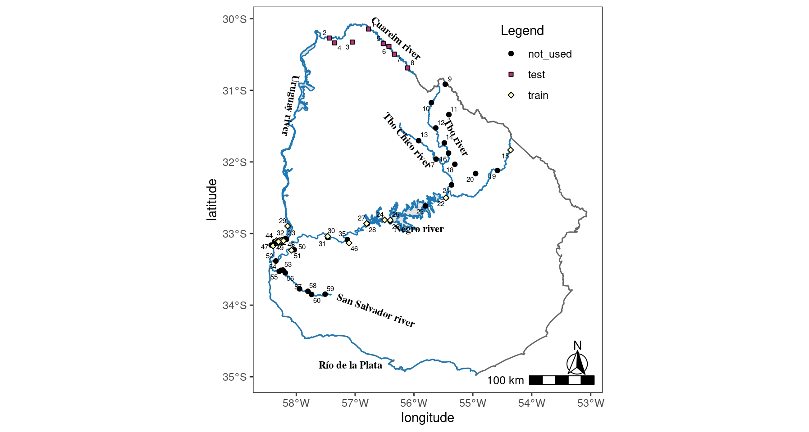

Sites Spatail Data
================

#### Packages

``` r
library(readxl) # to read xls files
library(tidyverse) # Data load/manipulation and graphics build
library(janitor)# Data headers make clean
library(lubridate) # Day/Time Manipulation
library(snakecase) # Factor levels and names manipulation
library(sf) # simple features for spatial data
library(mapsf) # helps to design various cartographic representations
library(geouy) # easily access official spatial data sets of Uruguay
library(ggspatial) # Spatial data framework for ggplot2
library(viridis) # color palette

#devtools::install_github("yutannihilation/ggsflabel") 
library(ggsflabel)# Experimental packages for better labelling of sf maps
###
```

### Site Coordinates table

``` r
sites <- read_excel("2.Datos/gis_data/sites_references.xls",
                     .name_repair = make_clean_names) %>% 
  mutate(
    programa = to_snake_case(programa),
    nombre_punto = to_snake_case (estacion),
    .keep= "unused")
```

Delete station from the bottom idetified by and `F` and the code end
label

``` r
 sites <- sites %>% filter(!str_detect(codigo_estacion,"F"))
```

Also load OAN Database, to match stations and calculte freqeuncy and
dates

``` r
oan_data <- read_csv("2.Datos/working_data/OAN_complet_data.csv")
```

Filter by data points from oan data, generate the varyble type and
arrange by `latitude`

``` r
 sites_reply <-sites %>%
  mutate(type = ifelse(
    str_detect(codigo_estacion, "RN|RU"),
    "train",
    ifelse(str_detect(codigo_estacion, "RC"), "test", "not_used")
  )) %>%
  arrange(latitud, .desc = TRUE) %>%
  mutate(site_number = row_number()) # Number code for each site
```

### Sampling stations data

Calculates n data per site and starting end dates

``` r
sites_oan_data <- oan_data %>% 
   group_by(estacion) %>% 
   summarize ( N_Station = length(estacion),
               Start_Date = min(date),
               End_Date = max(date)) %>% 
   rename (Sampling_Point = "estacion")
```

#### Table A1: Sampling station

``` r
sites_reply %>% 
   rename (Sampling_Point = "codigo_estacion",
           Latitude = "latitud",
           Longitude = "longitud",
           `Site Code` = "site_number") %>% 
    mutate (Basin = ifelse(str_detect(Sampling_Point,c("RC|RU|SSS")), "Uruguay","Negro")) %>% 
     full_join(sites_oan_data, by = "Sampling_Point") %>% 
      dplyr::select(Basin,Sampling_Point,Latitude,Longitude,type,N_Station,Start_Date,End_Date, `Site Code`) %>% 
  kable()
```

| Basin   | Sampling\_Point | Latitude   | Longitude  | type      | N\_Station | Start\_Date | End\_Date  | Site Code |
|:--------|:----------------|:-----------|:-----------|:----------|-----------:|:------------|:-----------|----------:|
| Uruguay | RC50            | -30.153338 | -56.784112 | test      |         31 | 2012-07-24  | 2018-07-31 |         1 |
| Uruguay | RC60            | -30.27903  | -57.41578  | test      |         39 | 2008-01-08  | 2017-08-01 |         2 |
| Uruguay | RC3C70          | -30.335783 | -57.046419 | test      |         24 | 2014-03-11  | 2018-07-31 |         3 |
| Uruguay | RCYU80          | -30.347013 | -57.328938 | test      |         23 | 2014-03-11  | 2018-07-31 |         4 |
| Uruguay | RC40            | -30.357963 | -56.547252 | test      |         49 | 2008-01-09  | 2018-07-31 |         5 |
| Uruguay | RC35            | -30.395397 | -56.455783 | test      |         49 | 2008-01-09  | 2018-08-02 |         6 |
| Uruguay | RC33            | -30.40431  | -56.452048 | test      |         NA | NA          | NA         |         7 |
| Uruguay | RC20            | -30.503327 | -56.367441 | test      |         41 | 2009-05-05  | 2018-08-01 |         8 |
| Uruguay | RC10            | -30.694941 | -56.150588 | test      |         29 | 2012-07-25  | 2018-08-01 |         9 |
| Negro   | CU1             | -30.917365 | -55.541327 | not\_used |          7 | 2017-02-08  | 2018-08-21 |        10 |
| Negro   | TG1             | -31.177506 | -55.762436 | not\_used |          1 | 2018-08-21  | 2018-08-21 |        11 |
| Negro   | CU2             | -31.340686 | -55.475883 | not\_used |          1 | 2018-08-21  | 2018-08-21 |        12 |
| Negro   | TG2             | -31.52985  | -55.686678 | not\_used |          1 | 2018-08-21  | 2018-08-21 |        13 |
| Negro   | TCH004          | -31.630071 | -56.14485  | not\_used |         NA | NA          | NA         |        14 |
| Negro   | TCH005          | -31.646331 | -56.087296 | not\_used |         NA | NA          | NA         |        15 |
| Negro   | TCH010          | -31.709354 | -55.963679 | not\_used |          7 | 2017-02-08  | 2018-08-20 |        16 |
| Negro   | CU3             | -31.737324 | -55.543746 | not\_used |          6 | 2017-02-08  | 2018-08-22 |        17 |
| Negro   | TCH015          | -31.748803 | -55.907431 | not\_used |         NA | NA          | NA         |        18 |
| Negro   | RN0             | -31.81922  | -54.459889 | train     |          6 | 2016-11-22  | 2018-07-02 |        19 |
| Negro   | TG3             | -31.879482 | -55.472443 | not\_used |          7 | 2017-02-07  | 2018-08-20 |        20 |
| Negro   | TCH020          | -31.965648 | -55.675629 | not\_used |          7 | 2017-02-09  | 2018-08-22 |        21 |
| Negro   | YA1             | -32.033503 | -55.366831 | not\_used |          7 | 2017-02-07  | 2018-08-20 |        22 |
| Negro   | RN1             | -32.109839 | -54.667486 | train     |         31 | 2009-05-26  | 2018-09-25 |        23 |
| Negro   | CA1             | -32.158081 | -55.023937 | not\_used |          7 | 2017-02-07  | 2018-08-20 |        24 |
| Negro   | TG4             | -32.321903 | -55.416429 | not\_used |          7 | 2017-02-07  | 2018-08-20 |        25 |
| Negro   | RN2             | -32.503888 | -55.505278 | train     |         30 | 2009-09-15  | 2018-09-25 |        26 |
| Negro   | RN3             | -32.621107 | -55.841937 | train     |         31 | 2009-05-26  | 2018-09-25 |        27 |
| Negro   | RN7             | -32.821112 | -56.513057 | train     |         31 | 2009-05-27  | 2018-09-26 |        28 |
| Negro   | RN5             | -32.823319 | -56.419437 | train     |         30 | 2009-05-27  | 2018-09-27 |        29 |
| Negro   | RN6             | -32.835265 | -56.419282 | train     |         31 | 2009-05-27  | 2018-09-27 |        30 |
| Negro   | RN10            | -32.871883 | -56.809333 | train     |         31 | 2009-05-28  | 2018-09-26 |        31 |
| Negro   | RN9             | -32.876116 | -56.798615 | train     |         31 | 2009-05-28  | 2018-09-26 |        32 |
| Uruguay | RU0             | -32.902139 | -58.116389 | train     |         21 | 2014-07-22  | 2018-09-04 |        33 |
| Negro   | AGDN1           | -32.905795 | -57.413038 | not\_used |         NA | NA          | NA         |        34 |
| Negro   | RN14            | -33.049706 | -57.453616 | train     |         31 | 2009-06-02  | 2018-10-02 |        35 |
| Negro   | RN13            | -33.066936 | -57.45417  | train     |         31 | 2009-06-02  | 2018-10-02 |        36 |
| Uruguay | RU1             | -33.074944 | -58.151806 | train     |         22 | 2014-07-22  | 2018-09-04 |        37 |
| Uruguay | RU2             | -33.086556 | -58.136611 | train     |         22 | 2014-07-22  | 2018-09-04 |        38 |
| Uruguay | RU4             | -33.0945   | -58.211889 | train     |         21 | 2014-07-22  | 2018-09-04 |        39 |
| Negro   | RN11            | -33.097219 | -57.126662 | train     |         31 | 2009-06-02  | 2018-10-02 |        40 |
| Uruguay | RU7             | -33.104111 | -58.25775  | train     |         22 | 2014-07-22  | 2018-09-04 |        41 |
| Uruguay | RU12            | -33.104667 | -58.301994 | train     |         22 | 2014-07-23  | 2018-09-05 |        42 |
| Uruguay | RU5             | -33.105167 | -58.216583 | train     |         22 | 2014-07-22  | 2018-09-04 |        43 |
| Uruguay | RU11            | -33.106111 | -58.2955   | train     |         22 | 2014-07-23  | 2018-09-05 |        44 |
| Uruguay | RU3             | -33.107472 | -58.186444 | train     |         22 | 2014-07-22  | 2018-09-04 |        45 |
| Uruguay | RU8             | -33.109417 | -58.265111 | train     |         22 | 2014-07-22  | 2018-09-04 |        46 |
| Uruguay | RU6             | -33.1115   | -58.219361 | train     |         22 | 2014-07-22  | 2018-09-04 |        47 |
| Uruguay | RU10            | -33.1155   | -58.282139 | train     |         22 | 2014-07-23  | 2018-09-05 |        48 |
| Uruguay | RU13            | -33.118056 | -58.3365   | train     |         22 | 2014-07-23  | 2018-09-05 |        49 |
| Uruguay | RU9             | -33.119361 | -58.269472 | train     |         22 | 2014-07-23  | 2018-09-05 |        50 |
| Negro   | RN12            | -33.143322 | -57.101672 | train     |         30 | 2009-09-22  | 2018-10-02 |        51 |
| Uruguay | RU15            | -33.165111 | -58.391917 | train     |         22 | 2014-07-23  | 2018-09-05 |        52 |
| Uruguay | RU16            | -33.168    | -58.358167 | train     |         22 | 2014-07-23  | 2018-09-05 |        53 |
| Uruguay | RU14            | -33.177139 | -58.359972 | train     |         22 | 2014-07-23  | 2018-09-05 |        54 |
| Negro   | RN15            | -33.234717 | -58.009994 | train     |         29 | 2009-06-03  | 2018-10-03 |        55 |
| Negro   | RN16            | -33.240824 | -58.056944 | train     |         30 | 2009-06-03  | 2018-10-03 |        56 |
| Negro   | AGDS1           | -33.248939 | -57.261889 | not\_used |         NA | NA          | NA         |        57 |
| Negro   | RN17            | -33.388324 | -58.317224 | train     |         31 | 2009-06-03  | 2018-10-03 |        58 |
| Negro   | SS12            | -33.502611 | -58.213424 | not\_used |         NA | NA          | NA         |        59 |
| Negro   | SS6             | -33.516199 | -58.200569 | not\_used |         25 | 2014-05-14  | 2018-10-23 |        60 |
| Negro   | SS6.5           | -33.519189 | -58.234396 | not\_used |         14 | 2016-07-26  | 2018-10-23 |        61 |
| Negro   | SS7             | -33.533889 | -58.264444 | not\_used |         11 | 2014-05-14  | 2016-05-10 |        62 |
| Negro   | SS5             | -33.555556 | -58.163611 | not\_used |         25 | 2014-05-14  | 2018-10-23 |        63 |
| Negro   | SS11            | -33.614    | -58.076489 | not\_used |         NA | NA          | NA         |        64 |
| Negro   | SS10            | -33.702102 | -57.912621 | not\_used |         NA | NA          | NA         |        65 |
| Negro   | SS9             | -33.756652 | -57.628741 | not\_used |         NA | NA          | NA         |        66 |
| Negro   | SS4             | -33.780012 | -57.928566 | not\_used |         24 | 2014-05-13  | 2018-10-23 |        67 |
| Negro   | SS3             | -33.816042 | -57.788771 | not\_used |         25 | 2014-05-13  | 2018-10-23 |        68 |
| Negro   | SS1             | -33.857532 | -57.501609 | not\_used |         25 | 2014-05-13  | 2018-10-23 |        69 |
| Negro   | SS2             | -33.860271 | -57.727698 | not\_used |         25 | 2014-05-13  | 2018-10-23 |        70 |

# Map With Sampling Stations

### Convert it to spacial object with crs 4326 projection

``` r
sites_longlat <- sites_reply %>%
  st_as_sf (coords = c("longitud", "latitud")) %>%
  st_sf (crs = 4326)
```

### Load Uruguay border cartography from package `geouy`

``` r
borders <- load_geouy("Uruguay")
```

    ## Reading layer `ine_pais_corregido' from data source 
    ##   `https://mapas.mides.gub.uy:443/geoserver/INECenso2004/ows?service=WFS&version=1.0.0&request=GetFeature&typeName=INECenso2004:ine_pais_corregido' 
    ##   using driver `GML'
    ## Simple feature collection with 1 feature and 1 field
    ## Geometry type: MULTIPOLYGON
    ## Dimension:     XY
    ## Bounding box:  xmin: 366582.2 ymin: 6127919 xmax: 858252.1 ymax: 6671738
    ## Projected CRS: WGS 84 / UTM zone 21S

``` r
rivers <-
  load_geouy("Cursos de agua navegables y flotables") %>% # Rivers cartography
  st_cast("MULTILINESTRING") # Convert multicurve to multistring https://github.com/r-spatial/sf/issues/1194
```

    ## Reading layer `cursos_nav_flot' from data source 
    ##   `https://geoservicios.mtop.gub.uy/geoserver/rec_hidrograficos/cursos_nav_flot/ows?service=WFS&request=GetFeature&typeName=cursos_nav_flot' 
    ##   using driver `GML'
    ## Simple feature collection with 52 features and 4 fields
    ## Geometry type: MULTICURVE
    ## Dimension:     XY
    ## Bounding box:  xmin: 366582.3 ymin: 6127927 xmax: 858252 ymax: 6671738
    ## Projected CRS: WGS 84 / UTM zone 21S

### Selected rivers and streams to plot

``` r
# A vector with river names separated by conditional symbol "|"
this_rivers <- paste(
  "uruguay",
  "cuareim",
  "río_negro",
  "tacuarembó",
  "tacuarembó_chico",
  "de_la_plata",
  "san_salvador",
  sep = "|"
)
```

Filter by selected rivers

``` r
study_rivers <- rivers %>%
  mutate(nombre = to_snake_case(nombre)) %>%
  filter(str_detect(nombre, this_rivers))
```

### Reservoirs and lagoons cartography dowloaded from DIva-Gis Free Spatial Data at country level `http://diva-gis.org/gdata`

``` r
water_bodies <-
  st_read ("2.Datos/gis_data/ury_inlandwater") %>%  # Uruguay/InlandWater
  mutate (name = to_snake_case(NAME),
          .keep = "unused") %>%  # te drop de old NAME column and retain the new one
  filter(name %in% c("rio_uruguay_uruguay", "embalse_del_rio_negro"))
```

    ## Multiple layers are present in data source /home/ignacio/Documentos/BIOLOGIA/Software/R/ReplyBerreta/Reply_STOTEN/2.Datos/gis_data/ury_inlandwater, reading layer `URY_water_areas_dcw'.
    ## Use `st_layers' to list all layer names and their type in a data source.
    ## Set the `layer' argument in `st_read' to read a particular layer.
    ## Reading layer `URY_water_areas_dcw' from data source 
    ##   `/home/ignacio/Documentos/BIOLOGIA/Software/R/ReplyBerreta/Reply_STOTEN/2.Datos/gis_data/ury_inlandwater' 
    ##   using driver `ESRI Shapefile'
    ## Simple feature collection with 41 features and 5 fields
    ## Geometry type: MULTIPOLYGON
    ## Dimension:     XY
    ## Bounding box:  xmin: -58.40722 ymin: -34.93358 xmax: -53.19166 ymax: -30.17501
    ## Geodetic CRS:  WGS 84

### Generate Base Map

``` r
base_map <- ggplot() +
  geom_sf (data = borders, fill = "NA", color = "grey40") +
  geom_sf (data = study_rivers, color = "#1f78b4") +
  geom_sf (data = water_bodies, color = "#1f78b4") +
  theme_bw() +
  theme(panel.grid = element_blank())
```

``` r
# Edit Rivers names, add to the plot maintaining its x,y coordinates

river_labels <- study_rivers %>%
  mutate(
    name = fct_recode(
      nombre,
      `Tbo Chico river` = "arroyo_tacuarembó_chico",
      `Negro river` = "río_negro",
      `Uruguay river` = "río_uruguay",
      `Cuareim river` = "río_cuareim",
      `San Salvador river` = "río_san_salvador",
      `Tbo river` = "río_tacuarembó",
      `Río de la Plata` = "río_de_la_plata"
    )
  )
```

``` r
# Map with site points filled if are used or not into BC2011
mapa_listo <-  base_map +
  geom_sf(
    data = sites_longlat,
    aes(fill = type, shape = type),
    size = 1.5,
    color = "black"
  ) +
  scale_fill_viridis(option = "magma", discrete = T) +
  scale_shape_manual(values = c(21, 22, 23), guide = "legend") +
  labs (fill = "Legend", shape = "Legend",) +
  annotation_scale(location = "br",
                   width_hint = 0.2,
                   text_cex = 0.8) +
  annotation_north_arrow(
    location = "br",
    which_north = "true",
    height = unit(1, "cm"),
    width = unit(1, "cm"),
    pad_y = unit(0.45, "cm"),
    style = north_arrow_fancy_orienteering
  ) +
  labs (x = "longitude", y = "latitude") +
  theme(legend.position = c(0.81, 0.85),
        legend.background  = element_blank()) +
  geom_sf_text(
    data = river_labels,
    aes(label = name),
    size = 3,
    fontface = "bold",
    family = "serif",
    hjust = c(
      `Tbo Chico river` = .7,
      `Negro river` =  .2,
      `Uruguay river` = 1,
      `Cuareim river` =  .3,
      `San Salvador river` = -.5,
      `Tbo river` = .3,
      `Río de la Plata` = 0.8
    ) ,
    vjust = c(
      `Tbo Chico river` = 1.8,
      `Negro river` =  3,
      `Uruguay river` = 1.7,
      `Cuareim river` =  -1.2,
      `San Salvador river` = 0,
      `Tacuarembó river` = -1.8,
      `Río de la Plata` = 2
    ),
    angle = c(
      `Tbo Chico river` = 310,
      `Negro river` =  0,
      `Uruguay river` = 260,
      `Cuareim river` =  320,
      `San Salvador river` = 340,
      `Tacuarembó river` = 300,
      `Río de la Plata` = 0
    ) 
  )
```

``` r
# Generate a character with equivalencies between number site and its code
caption_sites <- paste(sites_longlat$site_number,
                       sites_longlat$codigo_estacion,
                       sep = " = ") %>%
  str_c(., collapse = ", ")
```

# Published Map

``` r
 mapa_listo +
  geom_sf_text_repel(
    data = sites_longlat,
    aes(label = site_number),
    size = 2,
    max.overlaps = 20,
    box.padding = unit(0.1, "lines")
  )
```



``` r
sessionInfo()
```

    ## R version 4.1.1 (2021-08-10)
    ## Platform: x86_64-pc-linux-gnu (64-bit)
    ## Running under: Ubuntu 20.04.3 LTS
    ## 
    ## Matrix products: default
    ## BLAS:   /usr/lib/x86_64-linux-gnu/blas/libblas.so.3.9.0
    ## LAPACK: /usr/lib/x86_64-linux-gnu/lapack/liblapack.so.3.9.0
    ## 
    ## locale:
    ##  [1] LC_CTYPE=es_UY.UTF-8       LC_NUMERIC=C              
    ##  [3] LC_TIME=es_UY.UTF-8        LC_COLLATE=es_UY.UTF-8    
    ##  [5] LC_MONETARY=es_UY.UTF-8    LC_MESSAGES=es_UY.UTF-8   
    ##  [7] LC_PAPER=es_UY.UTF-8       LC_NAME=C                 
    ##  [9] LC_ADDRESS=C               LC_TELEPHONE=C            
    ## [11] LC_MEASUREMENT=es_UY.UTF-8 LC_IDENTIFICATION=C       
    ## 
    ## attached base packages:
    ## [1] stats     graphics  grDevices utils     datasets  methods   base     
    ## 
    ## other attached packages:
    ##  [1] ggsflabel_0.0.1   viridis_0.6.1     viridisLite_0.4.0 ggspatial_1.1.5  
    ##  [5] geouy_0.2.5       mapsf_0.2.0       sf_1.0-2          snakecase_0.11.0 
    ##  [9] lubridate_1.7.10  janitor_2.1.0     forcats_0.5.1     stringr_1.4.0    
    ## [13] dplyr_1.0.7       purrr_0.3.4       readr_2.0.1       tidyr_1.1.3      
    ## [17] tibble_3.1.4      ggplot2_3.3.5     tidyverse_1.3.1   readxl_1.3.1     
    ## [21] knitr_1.33       
    ## 
    ## loaded via a namespace (and not attached):
    ##  [1] httr_1.4.2         bit64_4.0.5        vroom_1.5.4        jsonlite_1.7.2    
    ##  [5] modelr_0.1.8       assertthat_0.2.1   highr_0.9          sp_1.4-5          
    ##  [9] cellranger_1.1.0   ggrepel_0.9.1      yaml_2.2.1         pillar_1.6.2      
    ## [13] backports_1.2.1    lattice_0.20-44    glue_1.4.2         digest_0.6.27     
    ## [17] rvest_1.0.1        colorspace_2.0-2   htmltools_0.5.1.1  pkgconfig_2.0.3   
    ## [21] broom_0.7.9        raster_3.4-13      haven_2.4.3        scales_1.1.1      
    ## [25] tzdb_0.1.2         proxy_0.4-26       farver_2.1.0       generics_0.1.0    
    ## [29] ellipsis_0.3.2     withr_2.4.2        cli_3.0.1          magrittr_2.0.1    
    ## [33] crayon_1.4.1       evaluate_0.14      fs_1.5.0           fansi_0.5.0       
    ## [37] xml2_1.3.2         class_7.3-19       ggthemes_4.2.4     tools_4.1.1       
    ## [41] hms_1.1.0          lifecycle_1.0.0    munsell_0.5.0      reprex_2.0.1      
    ## [45] compiler_4.1.1     e1071_1.7-8        rlang_0.4.11       classInt_0.4-3    
    ## [49] units_0.7-2        grid_4.1.1         rstudioapi_0.13    rmarkdown_2.10    
    ## [53] gtable_0.3.0       codetools_0.2-18   DBI_1.1.1          curl_4.3.2        
    ## [57] R6_2.5.1           gridExtra_2.3      rgdal_1.5-23       bit_4.0.4         
    ## [61] utf8_1.2.2         KernSmooth_2.23-20 stringi_1.7.3      parallel_4.1.1    
    ## [65] Rcpp_1.0.7         vctrs_0.3.8        dbplyr_2.1.1       tidyselect_1.1.1  
    ## [69] xfun_0.25
