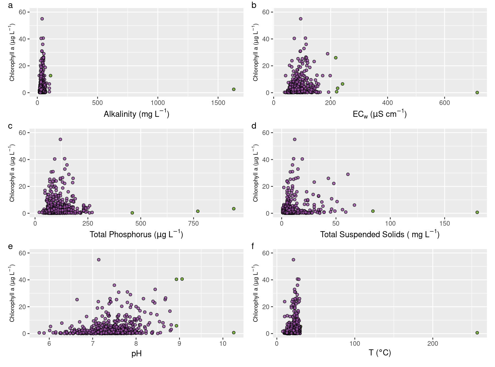
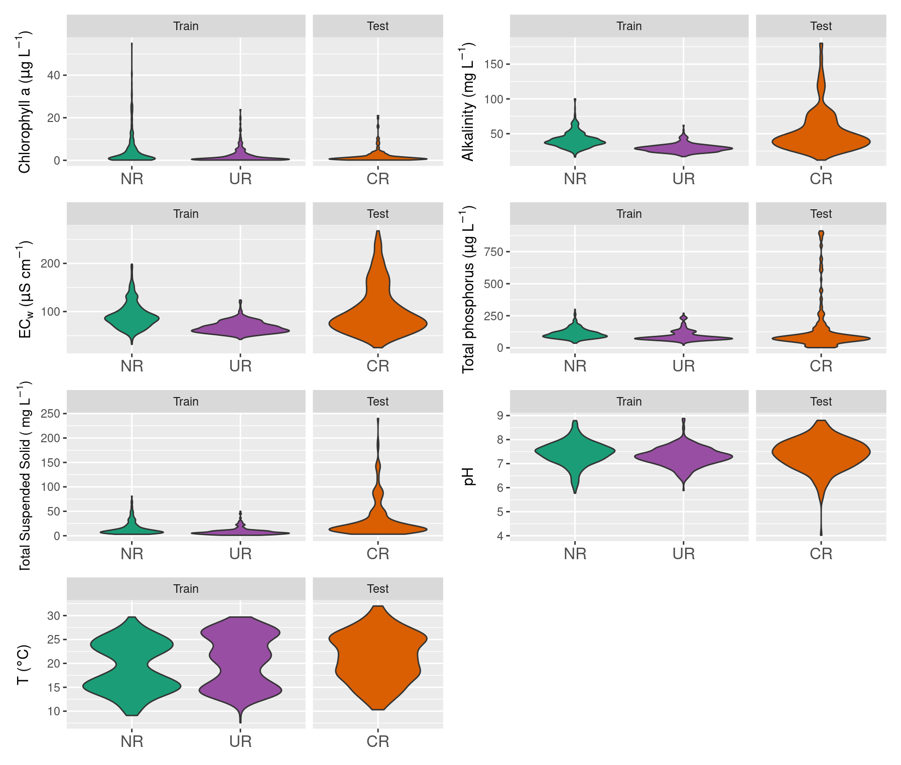

Data Analysis and Figures
================

### Functions load

``` r
library(tidyverse) # Data load/manipulation and graphics build
library(RColorBrewer) # Color Palettes
library(lubridate) # Day/Time Manipulation
library(patchwork) # Plot Layout
library(png) # Import `png` images
```

### Data Load

``` r
data_oan <- read_csv("2.Datos/working_data/bc2021_data.csv")
glimpse(data_oan)
```

    ## Rows: 1,122
    ## Columns: 12
    ## $ clorofila_a_mg_l                    <dbl> NA, NA, NA, NA, NA, NA, NA, NA, NA…
    ## $ alcalinidad_total_mg_ca_co3_l       <dbl> 84, 80, 79, 85, 110, 110, 68, 29, …
    ## $ conductividad_m_s_cm                <dbl> 193.5, 154.7, 155.8, 185.0, 241.0,…
    ## $ fosforo_total_mg_p_l                <dbl> NA, 42, 5, NA, 12, 51, 38, 34, 48,…
    ## $ solidos_suspendidos_totales_mg_l    <dbl> 16, 23, 120, NA, NA, 16, NA, NA, N…
    ## $ potencial_de_hidrogeno_p_h_sin_unid <dbl> 7.10, 6.71, 6.27, 8.22, 7.85, 7.53…
    ## $ temperatura_o_c                     <dbl> 30.9, 32.0, 32.2, 28.0, 28.7, 28.4…
    ## $ date                                <date> 2008-01-08, 2008-01-09, 2008-01-0…
    ## $ date_time                           <dttm> 2008-01-08, 2008-01-09, 2008-01-0…
    ## $ estacion                            <chr> "RC60", "RC35", "RC40", "RC35", "R…
    ## $ river                               <chr> "Cuareim", "Cuareim", "Cuareim", "…
    ## $ data_model                          <chr> "Test", "Test", "Test", "Test", "T…

Define de row names that belongs to ID of data like: `date`, `site`,
`river`…

``` r
id_vars <- c("date","date_time", "estacion","river","data_model")
```

# Rename Variables for easy coding

``` r
data_oan <- data_oan %>% 
  rename(chla = "clorofila_a_mg_l",
         alk = "alcalinidad_total_mg_ca_co3_l",
         cond = "conductividad_m_s_cm",
         tot_phos = "fosforo_total_mg_p_l",
         tss = "solidos_suspendidos_totales_mg_l",
         pH = "potencial_de_hidrogeno_p_h_sin_unid",
         temp = "temperatura_o_c")
```

### 99.5 percentile limits for Chl-a

#### BC2021 outliers removed

We need to assume that BC2021 Calculated the 99.5 limit using Negro and
Uruguay together. Lets see how many data exceed this criteria

``` r
data_oan %>% 
  filter(river %in% c("Negro","Uruguay")) %>% 
  filter(chla >= quantile(chla, probs = c(0.995), na.rm = T)) %>%
  dplyr::select(date, estacion, chla) %>% kable()
```

| date       | estacion |  chla |
|:-----------|:---------|------:|
| 2012-01-19 | RN5      |  72.5 |
| 2012-08-15 | RN6      | 179.0 |
| 2012-12-05 | RN3      | 276.0 |
| 2012-12-06 | RN5      | 192.0 |

-   Looks similar that they did, but with this criteria the RN12
    (2018-04-17) does not get excluded What happens if `chla` was
    calculated for each river?. How many values should be eliminated?

``` r
#Function that calcultaes the number of elements that exceed 99.5 limit
  q99.5_exceed <- function (x){
    q <- quantile(x, probs = c(0.995), na.rm =T)
  sum(x > q, na.rm = T)
    }
```

# Number of data exceeds 99.5 for each variable in Uruguay and Negro

``` r
 data_oan %>% filter(river %in% c("Uruguay", "Negro"))  %>% 
   summarize(across(where(is.numeric), q99.5_exceed)) %>% 
  kable()
```

| chla | alk | cond | tot\_phos | tss |  pH | temp |
|-----:|----:|-----:|----------:|----:|----:|-----:|
|    4 |   3 |    5 |         5 |   3 |   5 |    5 |

Group by River and calculate the number of data exceeds 99.5 for each
variable

``` r
data_oan %>% group_by(river)  %>% 
summarize(across(where(is.numeric), q99.5_exceed)) %>% 
  kable()
```

| river   | chla | alk | cond | tot\_phos | tss |  pH | temp |
|:--------|-----:|----:|-----:|----------:|----:|----:|-----:|
| Cuareim |    1 |   1 |    2 |         2 |   1 |   1 |    2 |
| Negro   |    2 |   3 |    3 |         3 |   2 |   3 |    3 |
| Uruguay |    2 |   2 |    2 |         2 |   2 |   1 |    1 |

Q99.5 values for chla by river

``` r
data_oan %>% group_by(river) %>% 
  dplyr::select(date, estacion, chla, river) %>% 
  summarise(chla_99.5 = quantile(chla, probs = c(0.995), na.rm = T)) %>% kable()
```

| river   | chla\_99.5 |
|:--------|-----------:|
| Cuareim |    21.3375 |
| Negro   |   181.4050 |
| Uruguay |    19.9590 |

### Lets calculate de Q99.5 for any numeric variable

``` r
# Function that returns de value of Q99.5  
q_calc<- function(x) {
 q <- quantile(x, probs = c(0.995), names = F,na.rm = T)
}
```

Apply de q\_calc for each numeric column from Negro and Uruguay rivers

``` r
data_oan %>% 
    filter(river %in% c("Negro","Uruguay")) %>% 
    summarise( across(where(is.numeric), q_calc)) %>% 
  kable()
```

|   chla | alk |   cond | tot\_phos |    tss |      pH |   temp |
|-------:|----:|-------:|----------:|-------:|--------:|-------:|
| 70.225 | 100 | 214.57 |    279.65 | 81.855 | 8.92225 | 29.794 |

### Chla vs All all values

``` r
# Generate de data frame to make one plot for each variable
# With a data-list each var transform into single data frame to make the plot
chla_allvalues <- data_oan %>%
  filter (river %in% c("Negro", "Uruguay")) %>% 
    pivot_longer(
    cols = !c(all_of(id_vars), chla)) %>% 
  group_by(name) %>% 
  nest()

# Function that make a plot for each variable 
figa1_func <- function (data) { 
  # Define de q99.5 limit  
q <- quantile(data$value, probs = c(0.995), names = F,na.rm = T)
  data %>% 
    mutate(extra = ifelse(value > q, "1","0") ) %>% 
  ggplot(aes(x = value , y = chla, fill = extra)) +
    geom_point(alpha = 0.8, size = 1.5, pch = 21) +
    scale_y_continuous(limits = c(0,60)) +
    scale_fill_manual(na.translate = FALSE , values = c("#984ea3", "#66a61e")) +
    labs(y = expression(paste("Chlorophyll a (", mu,"g L"^-1,")"))) +
    theme(axis.title.y = element_text(size = 8)) +
    guides (fill = "none")
         }
# Apply figa1_function for each variable

data_chla_all <- chla_allvalues %>% 
  mutate(plots = map(data, figa1_func)) 

# Extract the plots information obly 
chla_plots<- data_chla_all %>%  ungroup() %>% 
  dplyr::select(plots) 

# Extract each plot for label variables adequately

figa1_alk <- chla_plots[[1]][[1]] +
  labs(x = expression(paste("Alkalinity (mg L"^-1,")")) )

figa1_ec <- chla_plots[[1]][[2]] +
  labs(x = expression(paste("EC"[w] ," (", mu,"S cm"^-1,")")) )

figa1_tp <- chla_plots[[1]][[3]] +
  labs(x = expression(paste("Total Phosphorus (", mu,"g L"^-1,")")) )

figa1_sst <- chla_plots[[1]][[4]] +
  labs(x = expression(paste("Total Suspended Solids ( mg L"^-1,")")) ) 

figa1_ph <- chla_plots[[1]][[5]] +
  labs(x = "pH" )

figa1_ta <- chla_plots[[1]][[6]] +
  labs(x = expression(paste("T (", degree,"C)")) ) 
```

``` r
wrap_plots( figa1_alk,figa1_ec,
                     figa1_tp,figa1_sst,figa1_ph,
                     figa1_ta, ncol = 2) +
  plot_annotation(tag_levels = 'a') &
  theme(plot.tag.position = c(0, 1),
        plot.tag = element_text(size = 12, hjust = 0, vjust = 0))
```


Figure 3 from BC2021 replicated with the outliers highlighted in green
according our analysis (values higher than the 99.5% percentile.

### Substitute all values that exceed 99.5 and replace by NA

-   For Each variable in `Negro` and `Uruguay` together (for similarity
    with the BC2021 procedure)
-   For `Cuareim` this is done alone

``` r
# Function that replace a values with NaN if it exceed 99.5 limit

q99.5_remove <- function(x){
  q = quantile(x, probs = c(0.995), na.rm = T)
  x_c = ifelse(x <= q , x , NaN)
}

# For Negro and Uruguay together

data_cut_NU <- data_oan %>% 
  filter (river %in% c("Negro","Uruguay")) %>% 
  mutate(across(where(is.numeric), q99.5_remove))

# For Cuareim only
data_cut_C <- data_oan %>% 
  filter (river == "Cuareim") %>% 
  mutate(across(where(is.numeric), q99.5_remove))

bc_data_limit <- bind_rows(data_cut_NU,data_cut_C) 
```

## chla vs environment

### Figure 3 from BC 2021 recreation

Store the maximum values for X axes according to BC2021(Figure 3)

``` r
plot_x_limits <- tribble(
  ~name, ~lmin, ~lmax,
  "alk", 0, 150,
  "cond",0, 300,
  "tot_phos", 0, 1000,
  "pH", 5,8,
  "tss", 0, 600,
  "temp", 0 , 40
)
```

Generate de data frame to make one plot for each variable. With a
data-list each var transform into single data frame to make the plot

``` r
data_fig3 <- bc_data_limit %>% 
  filter (river != "Cuareim") %>% 
  dplyr::select(!all_of(id_vars)) %>% 
  pivot_longer (cols =! chla) %>% 
  group_by (name) %>% 
  nest()

# Add x limits
data_fig3 <- data_fig3 %>% 
  left_join(plot_x_limits, id = "name")
```

``` r
# Function that generates a plot for any numerical variable vs chla
# Set x axes range according to the same as BC2021
fig3_function_plot <- function (data, lmin,lmax,xlab) {
  ggplot(data, aes(x = value , y = chla)) +
    geom_point(alpha = 0.8, size = 1.5 ) +
    scale_x_continuous(limits = c( xmin = lmin , xmax = lmax)) +
    scale_y_continuous(limits = c(0,45),
                       breaks = seq(from = 0,to=48,by = 5)) +
    labs( x = xlab, y = expression(paste("Chlorophyll a (", mu,"g L"^-1,")"))) +
    theme_classic() +
    theme(axis.title = element_text(size = 10))
    
}

# Apply the plot function for each variable

data_fig3 <- data_fig3 %>% 
  mutate (plot = pmap(list(data,lmin,lmax,name), fig3_function_plot))

# Extract only plots information
plots3<- data_fig3 %>%  ungroup() %>% 
  dplyr::select(plot) 
```

Extract each plot for label variables adequately

``` r
fig3_alk <- plots3[[1]][[1]] +
  labs(x = expression(paste("Alkalinity (mg L"^-1,")")) )

fig3_ec <- plots3[[1]][[2]] +
  labs(x = expression(paste("EC"[w] ," (", mu,"S cm"^-1,")")) )

fig3_tp <- plots3[[1]][[3]] +
  labs(x = expression(paste("Total Phosphorus (", mu,"g L"^-1,")")) )

fig3_sst <- plots3[[1]][[4]] +
  labs(x = expression(paste("Total Suspended Solids ( mg L"^-1,")")) ) 

fig3_ph <- plots3[[1]][[5]] +
  labs(x = "pH" )

fig3_ta <- plots3[[1]][[6]] +
  labs(x = expression(paste("T (", degree,"C)")) ) 
```

### Load all panel figures copied from BC2021 that are saved each one ina differente `.png` file

``` r
# Special case functions for import png figure and combine with ours
library(png) # To upload png images obtained from BC2021
library(grid) # Convert PNG to Grob
library(ggplotify) # Convert Grob to GGPLOT
library(cowplot) # Paste plots together

# Load `png` and transform
f3a<-readPNG("2.Datos/Fig3BC/3a.png")
fig3a <- as.ggplot(grid::rasterGrob(f3a, interpolate=TRUE))
f3b<-readPNG("2.Datos/Fig3BC/3b.png")
fig3b <-as.ggplot(grid::rasterGrob(f3b, interpolate=TRUE))
f3c<-readPNG("2.Datos/Fig3BC/3c.png")
fig3c <- as.ggplot(grid::rasterGrob(f3c, interpolate=TRUE))
f3d<-readPNG("2.Datos/Fig3BC/3d.png")
fig3d <- as.ggplot(grid::rasterGrob(f3d, interpolate=TRUE))
f3e<-readPNG("2.Datos/Fig3BC/3e.png")
fig3e <- as.ggplot(grid::rasterGrob(f3e, interpolate=TRUE))
f3f<-readPNG("2.Datos/Fig3BC/3f.png")
fig3f <- as.ggplot(grid::rasterGrob(f3f, interpolate=TRUE))

# Paste together each variable fig from BC and our
figure3a <- ggdraw(fig3_alk + theme_half_open(12)) +
  draw_plot(fig3a, .45, .45, .5, .5) +
  draw_plot_label(
    c("A", ""),
    c(0, 0.45),
    c(1, 0.95),
    size = 12
  )

figure3b <- ggdraw(fig3_ec + theme_half_open(12)) +
  draw_plot(fig3b, .45, .45, .5, .5) +
  draw_plot_label(
    c("B", ""),
    c(0, 0.45),
    c(1, 0.95),
    size = 12
  )

figure3c <- ggdraw(fig3_tp + theme_half_open(12)) +
  draw_plot(fig3c, .45, .45, .5, .5) +
  draw_plot_label(
    c("C", ""),
    c(0, 0.45),
    c(1, 0.95),
    size = 12
  )


figure3d <- ggdraw(fig3_ph + theme_half_open(12)) +
  draw_plot(fig3d, .45, .45, .5, .5) +
  draw_plot_label(
    c("D", ""),
    c(0, 0.45),
    c(1, 0.95),
    size = 12
  )


figure3e <- ggdraw(fig3_sst + theme_half_open(12)) +
  draw_plot(fig3e, .45, .45, .5, .5) +
  draw_plot_label(
    c("E", ""),
    c(0, 0.45),
    c(1, 0.95),
    size = 12
  )


figure3f <- ggdraw(fig3_ta + theme_half_open(12)) +
  draw_plot(fig3f, .45, .45, .5, .5) +
  draw_plot_label(
    c("F", ""),
    c(0, 0.45),
    c(1, 0.95),
    size = 12
  )
```

### Plot figure 3

``` r
plot_grid(fig3a, fig3_alk,
                           fig3b, fig3_ec,
                           fig3c, fig3_tp,
                           fig3d, fig3_ph,
                           fig3e, fig3_sst,
                           fig3f, fig3_ta,
                           labels = c("", "a'",
                                      "", "b'",
                                      "", "c'",
                                      "", "d'",
                                      "", "e'",
                                      "", "f'"),
                           label_x=.8,
                           label_fontface = "plain",
                           label_fontfamily = "times")
```


Biplots of Chl-a versus all environmental variables: a: alkalinity, b:
EC, c: total phosphorous, d: pH, e:total suspended solids, f:
temperature. In all comparative cases, the graphs redrawn from BC2021
are show to the left (letters) and our graphs to the right
(prime-letters). To facilitate the visual comparison between Figure 3 of
BC2021 and this paper, the axes (x and y) of the biplots are drawn with
the same scaling. Note that this procedure leaves out 58 pH values in
our plot (d´) but incudes the Chl-a value of 55 µg L-1 that BC2021
considered to as an outlier, which is not an outlier according to the
analysis presented by us.

### Differences within rivers used for train model (Negro and Uruguay)

Generate de data frame to plot the variables for each river. With a
data-list each var transform into single data frame to make the plot

``` r
diff_rivers_data <- bc_data_limit %>% 
  pivot_longer (!all_of(id_vars)) %>% 
  mutate (river_label = fct_recode(river,
                                   UR = "Uruguay",
                                   NR = "Negro",
                                   CR = "Cuareim")) %>% 
  group_by(name) %>% 
  nest()

# Function that for each variable plot the violins seprating each river and facetting if data were used for model train or test

fig4_function <- function(data) {
  p1 <- ggplot(data, aes(y = value, x = river_label)) + 
    geom_violin(aes(fill = river)) +
    scale_fill_manual(na.translate = FALSE , 
                      values = c("#d95f02", "#1b9e77","#984ea3"))+
    theme(legend.position = "none",
          axis.text.x = element_text(size = 12)) +
    labs(x = NULL) +
    facet_grid( ~ fct_relevel(data_model,"Train","Test"),
                scales = "free_x",
                space = "free_x")
  
}

# Apply the plot function for each variable 
fig4_rivers <- diff_rivers_data %>% 
  mutate(plots = map(data, fig4_function))

# Extract only plots information
plots4<-fig4_rivers %>%  ungroup() %>% 
  dplyr::select(plots) 
```

Extract each plot for label variables adequately

``` r
fig4_chla <- plots4[[1]][[1]] +
  labs(y =  expression(paste("Chlorophyll a (", mu,"g L"^-1,")")) )


fig4_alk <- plots4[[1]][[2]] +
  labs(y = expression(paste("Alkalinity (mg L"^-1,")")) )

fig4_ec <- plots4[[1]][[3]] +
  labs(y = expression(paste("EC"[w] ," (", mu,"S cm"^-1,")")) )

fig4_tp <- plots4[[1]][[4]] +
  labs(y = expression(paste("Total phosphorus (", mu,"g L"^-1,")")) )

fig4_sst <- plots4[[1]][[5]] +
  labs(y = expression(paste("Total Suspended Solid ( mg L"^-1,")"))) +
  theme(axis.title.y =  element_text(size = 10))

fig4_ph <- plots4[[1]][[6]] +
  labs(y = "pH" )

fig4_ta <- plots4[[1]][[7]] +
  labs(y = expression(paste("T (", degree,"C)")) )
```

Plot figure 4

``` r
wrap_plots(fig4_chla, fig4_alk,fig4_ec,
                      fig4_tp,fig4_sst,fig4_ph,
                      fig4_ta, ncol = 2)
```


Violin plots for environmental variables for Negro River (NR, green),
Uruguay River (UR, violet) and Cuareim River (CR, orange) respectively.
NR and UR data were used to train the model and data from CR to test
model performance. UR and NR exhibit significant differences (p-values
&lt; 0.05) in mean and variance for all environmental variables, except
for temperature variance. The full description of statistical test is
shown in Table S4 of Supplementary Material. Note that the Cuareim River
was subject to the same outlier removal procedure as explained in
section 1c of the methodology

### Generalized Least Squares (GLS) for river comparision

``` r
#This GLS function allows for compare differences between mean and variances
library(nlme)
gls.var.test<-function(data){
  x = data$x
  group = data$group
  if(is.null(group)){ data.gls<-x; colnames(data.gls)<-c("x","group")} else data.gls<-data.frame(x,group)
  
  if(any(!is.finite(data.gls[,1]))){ data.gls<-data.gls[which(is.finite(data.gls[,1])),]; warning("there were NaNs in the original x data")}# SACA LOS NAN
  if(any(!is.finite(data.gls[,2]))){ data.gls<-data.gls[which(is.finite(data.gls[,2])),]; warning("there were NaNs in the original group data")}# SACA LOS NAN
  
  modHeteroVar = gls(x~group, data=data.gls, weights = varIdent(form = ~1|group), method="ML") # Heterogeneous variance
  modHomoVar   = gls(x~group, data=data.gls, method="ML") # Homogeneous Variance
  modEqualMean = gls(x~1,     data=data.gls, weights = varIdent(form = ~1|group), method="ML")# Same mean all groups, different variance
  gls_data <- data.frame(VarTest=anova(modHeteroVar,modHomoVar)$`p-value`[2],
                         MeanTest=anova(modEqualMean,modHeteroVar)$`p-value`[2]) # Evaluar el loglikelyhood ratio test. p>0.01
}
```

Generate the data frame necessary for compare variables between rivers,
run the gls and extact information to a table

``` r
 diff_rivers_data %>% 
  unnest(cols = data) %>% 
  filter (river != "Cuareim") %>% 
  rename(x = value ,
        group = river ) %>% 
mutate (group = factor(group) )%>% 
  nest() %>% 
  mutate(gls = map(data, gls.var.test)) %>% 
  unnest(gls) %>% 
  mutate( VarTest = ifelse( VarTest <= 0.05, "p<0.05","n.s"),
          MeanTest = ifelse( MeanTest <= 0.05, "p<0.05","n.s")) %>% 
  dplyr::select(name,VarTest, MeanTest) %>% 
  kable()
```

| name      | VarTest   | MeanTest  |
|:----------|:----------|:----------|
| chla      | p&lt;0.05 | p&lt;0.05 |
| alk       | p&lt;0.05 | p&lt;0.05 |
| cond      | p&lt;0.05 | p&lt;0.05 |
| tot\_phos | p&lt;0.05 | p&lt;0.05 |
| tss       | p&lt;0.05 | p&lt;0.05 |
| pH        | p&lt;0.05 | p&lt;0.05 |
| temp      | n.s       | p&lt;0.05 |

#### Session info

``` r
sessionInfo()
```

    ## R version 4.1.0 (2021-05-18)
    ## Platform: x86_64-pc-linux-gnu (64-bit)
    ## Running under: Ubuntu 20.04.2 LTS
    ## 
    ## Matrix products: default
    ## BLAS:   /usr/lib/x86_64-linux-gnu/blas/libblas.so.3.9.0
    ## LAPACK: /usr/lib/x86_64-linux-gnu/lapack/liblapack.so.3.9.0
    ## 
    ## locale:
    ##  [1] LC_CTYPE=es_UY.UTF-8       LC_NUMERIC=C              
    ##  [3] LC_TIME=es_UY.UTF-8        LC_COLLATE=es_UY.UTF-8    
    ##  [5] LC_MONETARY=es_UY.UTF-8    LC_MESSAGES=es_UY.UTF-8   
    ##  [7] LC_PAPER=es_UY.UTF-8       LC_NAME=C                 
    ##  [9] LC_ADDRESS=C               LC_TELEPHONE=C            
    ## [11] LC_MEASUREMENT=es_UY.UTF-8 LC_IDENTIFICATION=C       
    ## 
    ## attached base packages:
    ## [1] grid      stats     graphics  grDevices utils     datasets  methods  
    ## [8] base     
    ## 
    ## other attached packages:
    ##  [1] nlme_3.1-152       cowplot_1.1.1      ggplotify_0.0.7    png_0.1-7         
    ##  [5] patchwork_1.1.1    lubridate_1.7.10   RColorBrewer_1.1-2 forcats_0.5.1     
    ##  [9] stringr_1.4.0      dplyr_1.0.7        purrr_0.3.4        readr_2.0.0       
    ## [13] tidyr_1.1.3        tibble_3.1.3       ggplot2_3.3.5      tidyverse_1.3.1   
    ## [17] knitr_1.33        
    ## 
    ## loaded via a namespace (and not attached):
    ##  [1] Rcpp_1.0.7          lattice_0.20-44     assertthat_0.2.1   
    ##  [4] digest_0.6.27       utf8_1.2.2          R6_2.5.0           
    ##  [7] cellranger_1.1.0    backports_1.2.1     reprex_2.0.0       
    ## [10] evaluate_0.14       httr_1.4.2          highr_0.9          
    ## [13] pillar_1.6.1        rlang_0.4.11        readxl_1.3.1       
    ## [16] rstudioapi_0.13     rmarkdown_2.9       labeling_0.4.2     
    ## [19] bit_4.0.4           munsell_0.5.0       broom_0.7.9        
    ## [22] compiler_4.1.0      modelr_0.1.8        xfun_0.24          
    ## [25] gridGraphics_0.5-1  pkgconfig_2.0.3     htmltools_0.5.1.1  
    ## [28] tidyselect_1.1.1    fansi_0.5.0         crayon_1.4.1       
    ## [31] tzdb_0.1.2          dbplyr_2.1.1        withr_2.4.2        
    ## [34] jsonlite_1.7.2      gtable_0.3.0        lifecycle_1.0.0    
    ## [37] DBI_1.1.1           magrittr_2.0.1      scales_1.1.1       
    ## [40] cli_3.0.1           stringi_1.7.3       vroom_1.5.3        
    ## [43] farver_2.1.0        fs_1.5.0            xml2_1.3.2         
    ## [46] rvcheck_0.1.8       ellipsis_0.3.2      generics_0.1.0     
    ## [49] vctrs_0.3.8         tools_4.1.0         bit64_4.0.5        
    ## [52] glue_1.4.2          hms_1.1.0           parallel_4.1.0     
    ## [55] yaml_2.2.1          colorspace_2.0-2    BiocManager_1.30.16
    ## [58] rvest_1.0.1         haven_2.4.1
