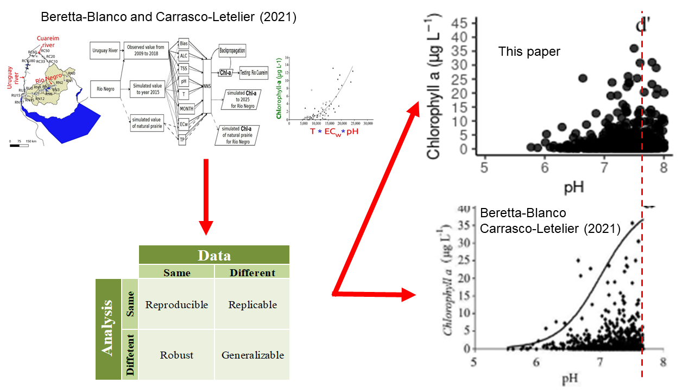

# Misinterpreting “Relevant factors in the eutrophication of the Uruguay River and the Río Negro” using ill-defined correlative approaches: a reply to Beretta-Blanco and Carrasco-Letelier (2021)

# Highlights

* BC2021 claim that temperature, pH and conductivity are the most relevant variables modulating chlorophyll-a in rivers

* BC2021 used public data-base to demonstrate the above fact

* BC2021 data analyses are not robust, generalizable, reproducible or replicable

* How can any given aquatic eutrophication process be sustained on temperature, pH and conductivity?

* Paradigm: nutrients enhance algal blooms

## [Original article](https://www.sciencedirect.com/science/article/pii/S0048969720368303) 

## [Data Base Integration](https://github.com/NAlcan/Reply_BC2021/blob/DevPublication/Interactive_code_files/Data_integration_md.md)

## [Data Analysis and Visualization](https://github.com/NAlcan/Reply_BC2021/blob/DevPublication/Interactive_code_files/Data_AnalysisVisualization.md)

## [Sampling Stations](https://github.com/NAlcan/Reply_BC2021/blob/DevPublication/Interactive_code_files/Sampling_Stations.md#table-a1-sampling-station)
